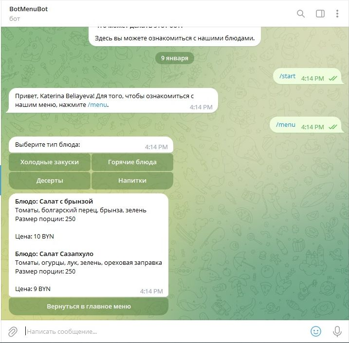

# Menubot + PostgreSQL

Телебот выполнен при помощи:

- Python 3.10
- pyTelegramBotAPI 4.7
- PostgreSQL

Принцип действия:

Чат бот просит выбрать категорию меню, после чего обращается к БД и выводит блюда с описанием и ценами в чате.
Есть доступ к аналитике через команду /admin. Выводит информацию о самые частонажимаемых кнопках бота и топ самых активных пользователей бота.
